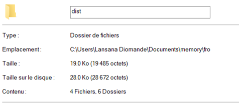
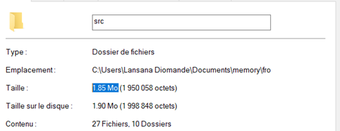
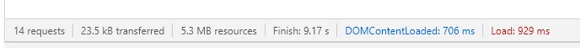

# Rendu de TP Application Design

**Nom :** DIOMANDE
**Prénom :** Lansana
**Groupe :**  MIN1

### 1.  While going through the 3 views of the application, how many files did your browser download in total? What was the total size of transfered data?
Le navigateur recharge les éléments dont il a besoin à chaque fois que la page change. On obtient donc des résultats pour chaque page.

En tout, il y’a 21 fichiers téléchargés et 1MB de données transférés.

### 2.  Component-oriented programming for the web is considered **more maintainable**. Why ?

Il est plus facile de maintenir ce type d'application web, car éléments des pages sont séparées en component. Ainsi lorsqu'un programmer à besoin de modifier une chose spécifique, il aura besoin de modifier uniquement les fichiers contenus dans le dossier portant le nom du component.

### 3.  If you look at the source code, every JS file wraps its code into a closure, what happens? Why?

La page n'apparaît pas dans le navigateur. Les différents fichiers ayant des noms de variables communes, le retrait des « closures » a créé de nombreux conflits. En effet les closures permettent de limiter la portée des variables au fichier dans lequel celles-ci sont contenus.

### 4.  By convention, all NPM dependencies use the same 3-digit style version numbers? How is it called?

La convention utilisée ici est la convention "semver". Il s'agit de noter les versions avec  3 valeurs  qu'on peut représenter par  ***X.Y.Z***.

Ainsi on a :

- ***X*** : le numéro de version ***MAJEUR***. C'est-à-dire lorsqu'il y a des modifications tellement profondes que des fonctionnalités de l'ancienne majeure ne fonctionnent plus.

- Y : le numéro de version ***MINEUR***. C'est-à-dire lorsqu'il y a des fonctionnalités qui viennent s'ajouter, mais qui ne bouleverse pas les anciennes utilisations.

- Z : le numéro de version de ***CORRECTIF***. C'est-à-dire lorsque certains bugs sont corrigés.

### 5.  What means the `^` symbol next to bootstrap version?
Ce symbole signifie que lorsque l'utilisateurs utilisera la commande `npm  install` ', la dépendance sera mise à jour vers la dernière version mineure (Y), sans incrémenter la version majeure (X) .

### 6.  As you can see, npm install command also generated a package-lock.json file along with package.json. What is the purpose of this file?

Ce fichier a pour objectif de contenir les vraies versions de chaque package présent dans le projet. En effet si je transmets mon projet avec uniquement le fichier package.json et qu'un autre développeur effectue la commande `npm  install` , les packages qu'il installera, ainsi que leurs dépendances auront potentiellement des versions plus avancées que la mienne du fait des différents préfixe présent dans les déclarations de versions. Le fichier package-lock.json va contenir les versions exactes de toutes les dépendances présentes dans le node_modules. Avec ce fichier le développeur utilisant la commande  `npm  install`  des dépendances ayant exactement les mêmes versions que celles que j'ai utilisé.

### 7. What is a devDependency exactly? What are the differences with a depencency?
***devDependency***  contient les dépendances qui seront utilisées uniquement en développement.

***Dependency***  contient les dépendances qui seront utilisées uniquement en production.

Ainsi lors en développement les dépendances présentes dans  ***Dependancy***  seront utilisées en plus des dépendances présentes dans  ***devDependancy***.

### 8. Can you think of at least 2 things that are possible with Java classes, but cannot be done with ES6 classes ?

En java, on a la possibilité de surcharger les méthodes des classes en plus de pouvoir appliquer le principe d'encapsulation. Cela n'est pas possible sur JavaScript.

### 9.  What are the differences between `var` and `let`  ?

Lorsqu'on déclare une variable avec ***let*** , sa portée est limitée au bloc dans lequel elle est déclarée.

En déclarant une variable avec ***var*** , sa portée sera globale. Néanmoins, il n'est pas impossible que sa valeur soit «  undefined  » à certains endroits.

### 10.   What is the `.bind(this)` stuff? What does happen if you remove it? Use your web browser's debugger to guess what happens ? Is it needed when using an _arrow function_ ?

L'utilisation de ***.bind(this)***  sur une fonction permet de transmettre à la fonction un objet que la fonction considèrera comme étant son ***this*** .

Lorsqu'on retire le  ***.bind(this)***  le programme ne se comporte pas comme nous le souhaitions.

En effet grâce au  débugger,  on peut remarquer en que sans le  ***.bind(this)*** , le ***this***  utilisé dans la fonction correspond à la fonction elle-même et non à la classe dans laquelle la fonction  est appelée.

En utilisant les fonctions fléchées, il n'y a pas besoin d'utiliser le ***.bind(this)*** . En effet le ***this***  du bloc dans lequel la fonction  est appelée  est transmis à l'intérieur de celle-ci.

### 11. What are the advantages of Promises?
Les promesses permettent de contrôler plus facilement le comportement des fonctions asynchrone. En effet grâce aux promesses, on est en mesure de définir les fonctions qui devront obligatoirement être lancé après que la fonction asynchrone soient réalisés dans son entièreté.

### 12. Inside wich version of ECMAScript async/await has been released ?
Les annotations async et await sont apparus avec ES8 (en 2017).

### 13.  What  does  the @ symbol  mean in @babel/***?

Le symbol ***@***  dans ***@babel/****** fonctionne comme une assurance de la provenance des packages. Ainsi on peut être sûre que les dépenses que nous allons installer proviennent bien de ***babel***. Par ailleurs, si ***babel*** à sa propre version du package ***http*** par exemple, on pourra différencier le package ***http*** et le package ***@babel/http*** .

### 14. Look a files produced within `dist/` folder. How did babel transpiled your class `WelcomeComponent`?

La classe WelcomeComponent est transpilé en une série de fonction dans des fonctions. Cela permet de simuler le fait une classe dans un langage qui n'est pas orienté objet.

### 15. What is the weight of the transpiled sources compared to your original sources?

Le dossier « dist » fait 19ko contre 1.85Mo pour le dossier « src ».

### 16. What is the difference between `import * from './utils'` and `import { parseUrl } from './utils'`?

Avec `import * from './utils'`, on importe toutes les fonctions du fichier tandis qu'avec `import { parseUrl } from './utils'` , on importe uniquement la fonction qui  nous intéresse dans  le fichier.

Au moment de la  transpilation,  le code générer par la première méthode sera plus lourd que celui générer par la deuxième méthode. Vérifier le texte

### 17. Why the `utils.js` will be also transpiled?

Il sera transpilé par ***babel***  car il est considéré comme un module. En effet le mot clé « import » a été utilisé afin de récupérer une de ses fonctions du dans le fichier ***main.js*** qui est lui-même le point d'entrée de l'application.

### 18. What does the `webpack --config webpack.config.js` do ?

Cette commande permet de configurer webpack à partir de diverses informations mise en forme préalablement dans le fichier webpack.config.js

### 19.  Play the whole game with `size=2`. While going through the 3 views of the application, how many files did your browser download in total? What was the total size of transfered data?

En tout 10 fichiers ont été téléchargés par le navigateur pour une taille totale de 23.5kb de données transférée.

### 20. Can you guess how `style-loader` works exactly?

Je pense que ***style-loader*** signifie qu’il va charger les éléments de style dans la page web.

### 21. What does the _ prefix means on a sass file?
Ajouter le préfixe « _ » au nom d'un fichier sass signifie que le fichier pourra être importé par un autre fichier sass.